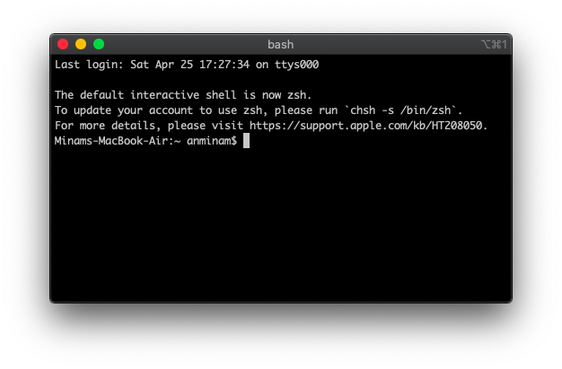
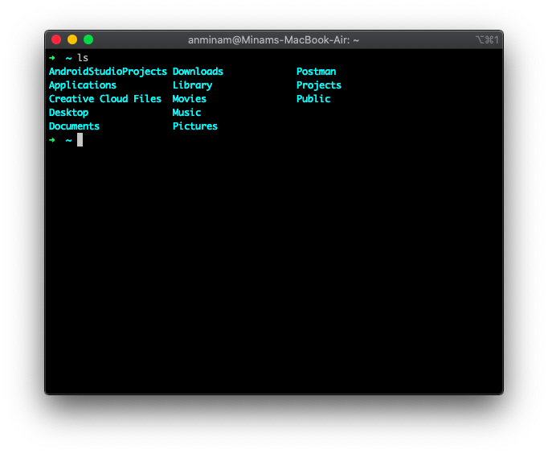
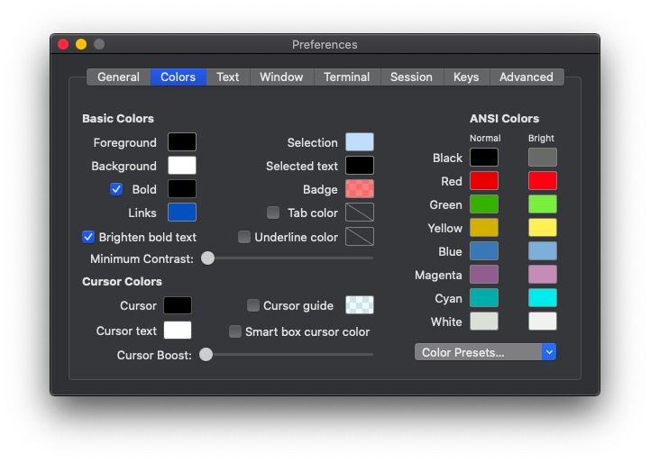
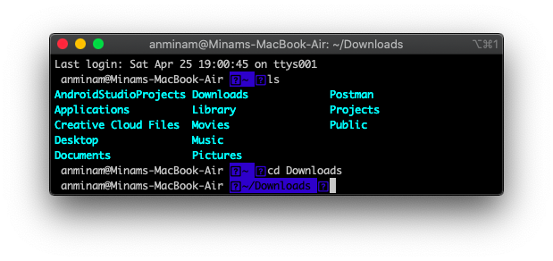
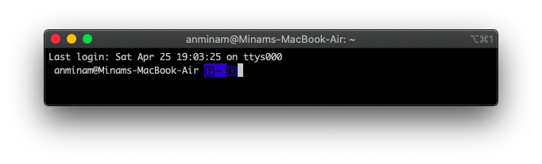
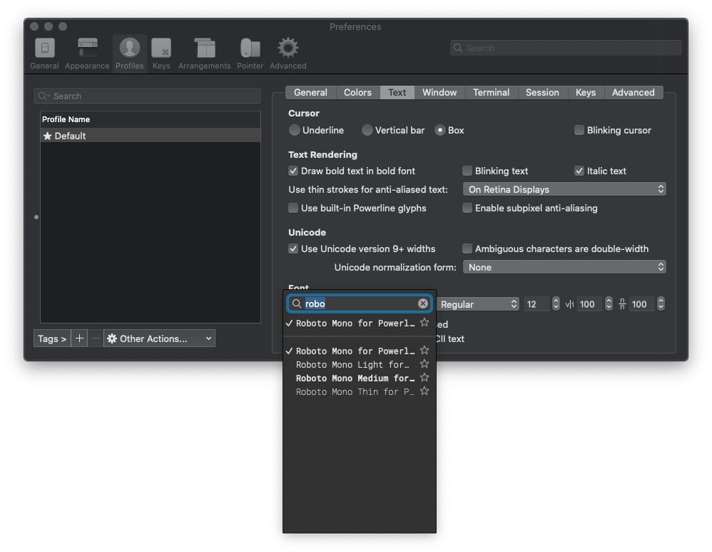
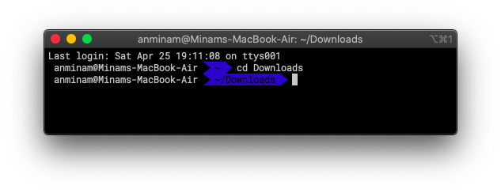

# Terminal - iTerm2

## 소개

 터미널 프로그램인 **iTerm2**란 기존 터미널이가진 bash쉘이 아닌 **zsh**를 사용함으로서 다양한 플러그 인과 테마 등을 사용 할 수 있습니다. 물론 Catalina 버전부터 기본 쉘을 **zsh** 로 변경하면서 기존 터미널에서도 사용 할 수 있게 되었지만 한눈에 들어오는 UI를 위해서라도 맥 사용자는 충분히 사용 가치를 가질 수 있습니다.

## 설치

#### iTerm2 설치 <a id="iterm2-&#xC124;&#xCE58;"></a>

 아래 링크 iTerm2 사이트에 접속해서 **iTerm2** 를 다운받습니다.



 다운로드를 받으신후 해당 파일\(압축돼있으면 해제한 후\)을 "응용 프로그램"에 이동 시킨후 실행시킵니다. 실행시키면 해당 창을 볼수 있습니다.




### Homebrew 설치

iTerm을 사용하여 Homebrew를 설치합니다. 홈브류\(Homebrew\)란 macOS 용 패키지관리자 입니다. 

 각자 맥OS 의 상태에따라 Homebrew를 사용하기위한 xcode 등 다양한 프로그램들을 받게될 수도 있습니다.\(자동입니다😀. 하지만 오래 걸릴 수 있습니다😢. \)

```bash
/usr/bin/ruby -e "$(curl -fsSL https://raw.githubusercontent.com/Homebrew/install/master/install)"
```

### 

### zsh 설치

 이제 **Homebrew**를 이용하여 **zsh**를 설치 합니다.

```bash
# 설치
brew install zsh

# zsh 설치경로 확인하기
which zsh

# 저의경우 아래와 같은 경로로 나왔습니다
----> /usr/local/bin/zsh
```

 이제 **iTerm2**를 사용할 준비가 됐습니다!!😀


## 플러그인

### OhMyZsh 설치하기

**oh-my-zsh**는 zsh 를 편리하게 사용할 수있는 플러그인입니다. 

```bash
# wget curl 설치
brew install curl

# oh-my-zsh 설치
sh -c "$(curl -fsSL https://raw.github.com/robbyrussell/oh-my-zsh/master/tools/install.sh)"
```

이제 이쁜 터미널을 갖게됐습니다.




## 테마

설치는 했지만 아직 기본 터미널과 다른점을 모르겠다는 느낌을 받을 수 있습니다. 부족한 느낌을 채우기위하여 테마를 설치해보겠습니다. 

1. [https://github.com/mbadolato/iTerm2-Color-Schemes](https://github.com/mbadolato/iTerm2-Color-Schemes) 에 접속합니다.
2. 사이트 아래쪽 스크린샷 테이블을 보면서 원하는 테마를 고릅니다.
3. **schemes** 를 다운 받습니다. \(귀찮으면 그냥 전체 다 다운 받아도됩니다.😀\)
4. 다운받은 **schemes** 폴더를 잘 기억하십시오.
5. 이제 iTerm로 돌아와서 단축키 **CMD + i \( ⌘ + i \)** 또는 _**iTerm2 &gt; Preferences &gt; Profiles &gt; Colors Tab**_ 에서 우측 하단 Color Presets을 클릭합니다.
6. **Import** 를 클릭하여 아까 받은 **schemes** 폴더에서 원하는 테마를 선택하시면 됩니다.




## 좀더 강력한 테마

 지금도 충분히 기본 terminal 보다 이쁘지만 좀더 이쁘게 해보겠습니다.

### agnoster

 많은 사람들이 사용하고있는 **agnoster** 테마입니다. **agnoster** 테마는  ****OhMyZsh에 기본으로 설치되있기 때문에 따로 받지 않으셔도 됩니다.

```bash
# .zshrc 파일 변경하기위해 파일열기
% vi ~/.zshrc

# ZSH_THEME 의 변수를 아래처럼 변경합니다.
ZSH_THEME="agnoster"
```

 이후 다시 실행시킵니다.



 보시는 것처럼 글꼴이 깨져있는 상태를 볼수있습니다. 

###  폰트설치

 글꼴 깨짐현상을 해결하기위해 글꼴 설치가 필요합니다.

```bash
# 클론
git clone https://github.com/powerline/fonts.git
cd fonts

# 폰트 설치
./install.sh

# 다운받은 폰트폴더 삭제
cd ..
rm -rf fonts
```

 이후 **iTerm**을 종료후 재실행하면 



### 폰트변경

 다시 설정으로 들어갑니다. 이번엔 단축키로 이동합니다. **CMD + i \( ⌘ + i \)**

**Profiles &gt;  Text**  탭에 **Font** 를 변경합니다. 아래의 폰트를 추천합니다.

* Roboto Mono for Powerline Regular
* Liberation Mono for Powerline Regular



  이제 폰트가 잘나오는 iTerm2 를 갖게됐습니다.



##  기타

### 추천테마 

agnoster.zsh-theme 에서는 아래와같은 테마를 추천한다고 합니다.

A ZSH theme optimized for people who use:

* Solarized
* Git
* Unicode-compatible fonts and terminals \(I use iTerm2 + Menlo\)

For Mac users, I highly recommend iTerm 2 + Solarized Dark

## 참고 자료

* [https://gist.github.com/agnoster/3712874](https://gist.github.com/agnoster/3712874)





