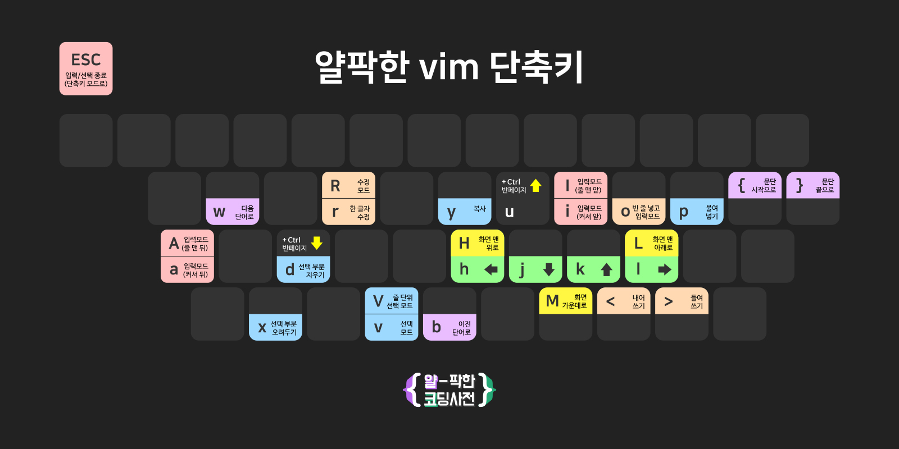

# Vim

### 빔 단축키 이미지

##  알아야할것

*  vim의 모드에는 각각 **일반 모드\(NORMAL\), 비주얼 모드 \(VISUAL\), ex 모드\(ex\)** 총 3가지 모드가 존재한다. 

## 이동

### 방향키

| 키 | 동작 |
| :--- | :--- |
| h | 왼쪽 |
| j | 아래 |
| k | 위 |
| l | 오른쪽 |

 주의사항

*  맨끝 줄 이라도 l\(오른쪽\) 키를 눌러도 다음 줄로 넘어가지않음

### 

### 글자방향

| 키 | 동작 |
| :--- | :--- |
| b | **현재 단어**의 **시작**, 한 더누를시 이전 단어의 시작  |
| w | **다음 단어**의 **시작** |
| e | **현재 단어**의 **끝**, 다음 단어의 끝 |

 주의사항

*  글자 방향키는 일반 방향키와 다르게 커서가 다음이나 이전으로 넘어감

###  브라켓이동

|  키 |  동작 |
| :--- | :--- |
| % |  브라켓 이 |

##  참고사이트

* [https://www.openvim.com/tutorial.html](https://www.openvim.com/tutorial.html)
* [https://nolboo.kim/blog/2016/11/15/vim-for-beginner/](https://nolboo.kim/blog/2016/11/15/vim-for-beginner/)

